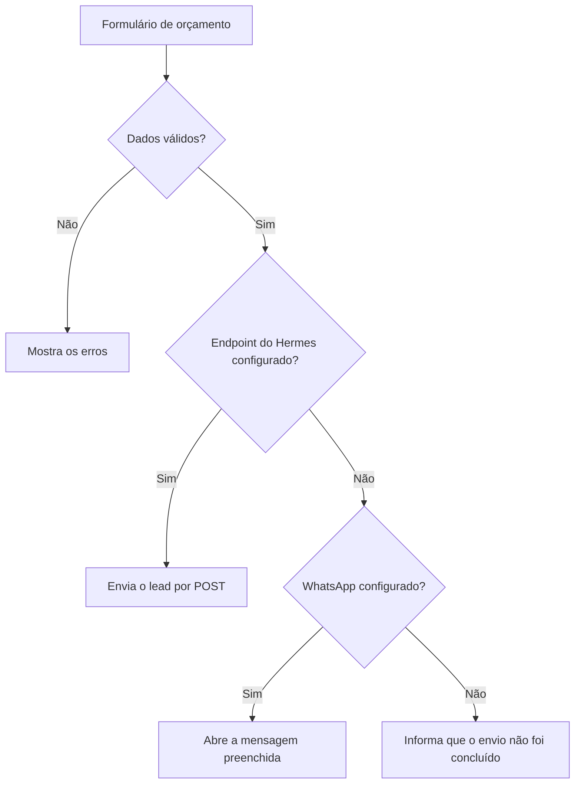
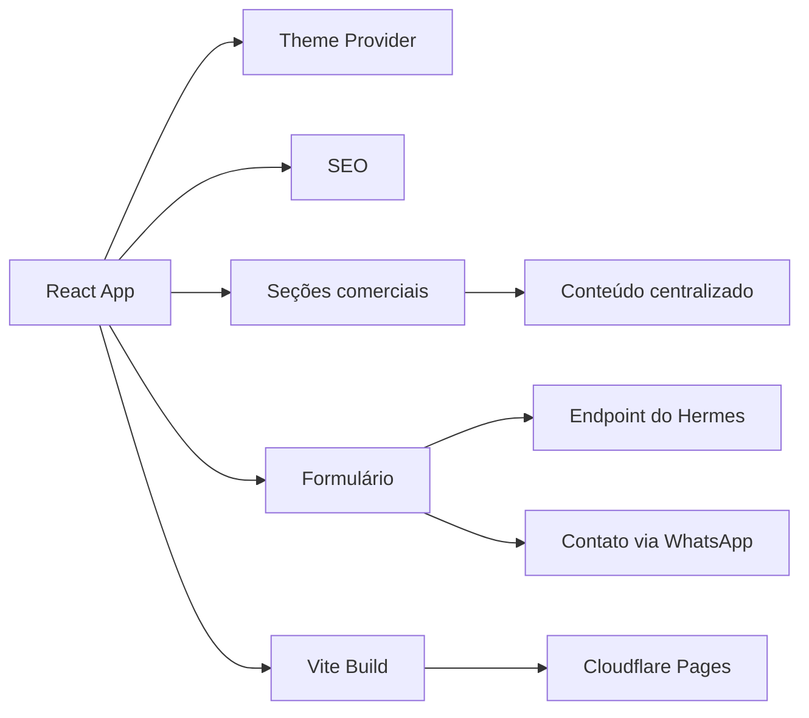

# Barthy Web Studio V1

Esta é a primeira versão do site institucional e comercial da **Barthy Web Studio**.

Criei a V1 para apresentar os serviços da marca, explicar como os projetos são conduzidos e receber pedidos de orçamento. O repositório continua público como parte da evolução técnica e visual da Barthy.

## Visão rápida

| Item | Descrição |
| --- | --- |
| Tipo | Site institucional e comercial |
| Versão | V1 |
| Aplicação | [barthy-web-studio.pages.dev](https://barthy-web-studio.pages.dev/) |
| Versão atual | [`barthy-web-studio-v2`](https://github.com/g4brielbr4sil/barthy-web-studio-v2) |
| Licença | Proprietária |

## O que tem nesta versão

A V1 apresenta soluções para pequenos negócios, como:

- landing pages e sites institucionais
- portfólios profissionais
- páginas para eventos e campanhas
- formulários e captação de leads
- CRM e pipeline
- dashboards e indicadores
- portais e áreas internas
- automações e integrações
- sistemas sob medida

A página também mostra projetos, processo de trabalho, pacotes, perguntas frequentes e canais de contato.

## Estrutura da página

```text
Header
Hero
O que a Barthy organiza
Soluções
Sistemas e CRM
Produtos e sistemas digitais
Experiência aplicada
Pacotes e preços
Como funciona
Hermes
FAQ
Formulário de orçamento
Footer
```

## Formulário de orçamento

O formulário coleta os dados necessários para o primeiro contato:

- nome
- WhatsApp
- e-mail opcional
- empresa
- cidade e UF
- tipo de serviço
- mensagem

O fluxo valida os campos, evita envio duplicado, leva o foco até o primeiro erro e mostra os estados de carregamento, sucesso ou falha.



Quando o endpoint do Hermes está configurado e responde corretamente, o lead é registrado pela integração. Sem esse endpoint, o site tenta abrir o contato pelo WhatsApp. Se nenhum canal estiver disponível, o formulário informa a falha em vez de mostrar um sucesso falso.

## Arquitetura



## Tecnologias

### Interface

- React 18
- TypeScript
- Vite
- Tailwind CSS
- Material UI e Emotion
- Radix UI
- Lucide React

### Interação e visualização

- GSAP
- Motion
- React Hook Form
- React Router
- Recharts
- dnd-kit
- Embla Carousel
- Sonner

### Qualidade e entrega

- pnpm
- GitHub Actions
- TypeScript typecheck
- build automatizado
- auditoria de dependências
- Cloudflare Pages

## Tema e acessibilidade

A interface inclui:

- temas claro e escuro
- aplicação antecipada do tema para reduzir a troca visual no carregamento
- componentes reutilizáveis
- animações progressivas
- suporte a movimento reduzido
- navegação por teclado
- foco visível
- validação acessível no formulário
- carregamento sob demanda
- tratamento de falhas

## Estrutura do projeto

```text
src/
  app/
    components/       seções e componentes visuais
    data/             conteúdo e configuração do site
    lib/              tema, Hermes e rastreamento
    types/            contratos TypeScript
  styles/             estilos globais
  main.tsx            inicialização da aplicação
public/                arquivos públicos
```

## Configuração

```env
VITE_HERMES_LEAD_ENDPOINT=
VITE_BARTHY_WHATSAPP_URL=
```

`VITE_HERMES_LEAD_ENDPOINT` aponta para o endpoint que recebe os leads.

`VITE_BARTHY_WHATSAPP_URL` define o contato usado como alternativa ao endpoint.

No Vite, tudo que começa com `VITE_` fica disponível no navegador. Não coloque senha, token ou outra informação privada nessas variáveis.

## Execução local

### Requisitos

- Node.js conforme `.nvmrc`
- pnpm conforme `packageManager` do `package.json`

```bash
pnpm install
pnpm dev
```

## Validação

```bash
pnpm typecheck
pnpm build
pnpm preview
pnpm audit --prod
```

## V1 e V2

| V1 | V2 |
| --- | --- |
| apresentação comercial mais extensa | narrativa editorial mais direta |
| catálogo amplo de soluções | foco em projetos, processo e posicionamento |
| Material UI, Radix, GSAP e Motion | Anime.js, CSS e recurso visual com shader |
| integração com Hermes ou WhatsApp | endpoint de contato e alternativa por e-mail |
| mais blocos e componentes | experiência mais enxuta |

A V1 foi a primeira estrutura comercial da Barthy. A V2 mantém a mesma base de trabalho, mas apresenta os projetos e o posicionamento de forma mais direta.

## Autor e contato

**Gabriel Brasil Barthy Elias**  
**Barthy Web Studio**

- GitHub: [@g4brielbr4sil](https://github.com/g4brielbr4sil)
- E-mail: [contato.barthywebstudio@gmail.com](mailto:contato.barthywebstudio@gmail.com)

Código, marca, identidade e conteúdo protegidos pela licença disponível em [`LICENSE`](LICENSE).
