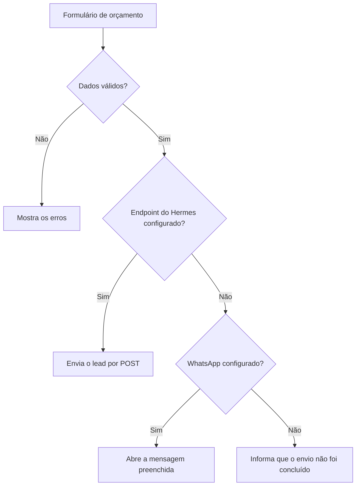
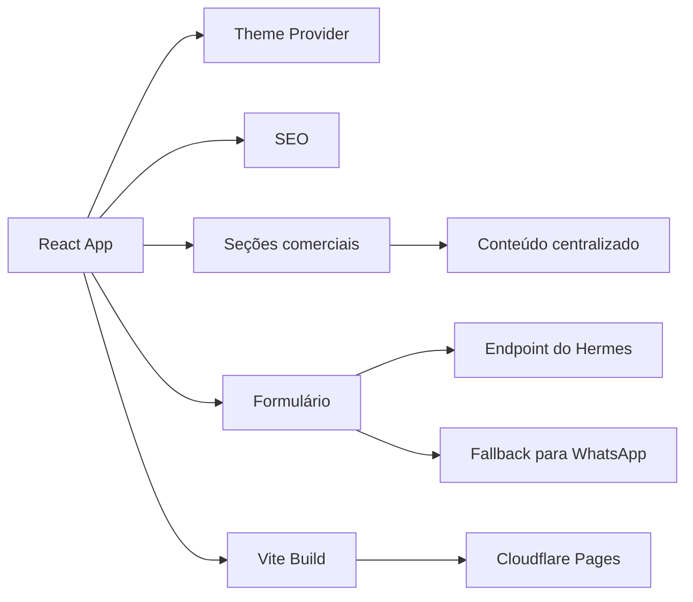

# Barthy Web Studio V1

Esta foi a primeira versão do site institucional da Barthy Web Studio, projeto que criei para apresentar soluções digitais para pequenos negócios.

A V1 reúne serviços, sistemas, projetos, processo comercial e canais de contato em uma experiência mais extensa e técnica. Ela continua publicada como registro da evolução da marca enquanto a V2 passa pelos últimos ajustes.

## Visão rápida

| Item | Descrição |
| --- | --- |
| Tipo | Site institucional e comercial |
| Versão | V1 |
| Status | Publicada |
| Aplicação | [barthy-web-studio.pages.dev](https://barthy-web-studio.pages.dev/) |
| Próxima versão | [`barthy-web-studio-v2`](https://github.com/g4brielbr4sil/barthy-web-studio-v2) |
| Licença | Proprietária |

## O que a V1 apresenta

A página organiza a proposta da Barthy em diferentes frentes:

- presença digital
- landing pages e portfólios
- formulários e captação de leads
- estrutura comercial digital
- CRM e pipeline
- dashboards e indicadores
- portais e áreas internas
- automações e integrações
- sistemas e plataformas sob medida

Esses itens representam soluções que podem ser desenvolvidas conforme diagnóstico e escopo. O site não trata todo o catálogo como produto pronto.

## Estrutura da página

```text
Header
Hero
O que a Barthy organiza
Soluções
Sistemas e CRM
Produtos e sistemas digitais
Experiência aplicada
Pacotes e preços
Como funciona
Hermes
FAQ
Formulário de orçamento
Footer
```

A V1 foi pensada como uma apresentação comercial completa, com mais conteúdo e mais detalhes sobre as possibilidades da operação.

## Funcionalidades

### Presença digital

- landing pages
- portfólios profissionais
- páginas institucionais
- páginas para eventos
- conteúdo organizado
- CTAs e formulários

### Operação comercial

- captação de contatos
- propostas
- mensagens comerciais
- follow-up
- formulários conectados
- encaminhamento de solicitações

### Sistemas e integrações

- CRM e pipeline
- dashboards
- portais e áreas internas
- SaaS e plataformas com login
- perfis de usuário
- autenticação e permissões
- APIs e conectores
- bots e automações após avaliação técnica

## Captação de leads

O formulário de orçamento coleta:

- nome
- WhatsApp
- e-mail opcional
- empresa
- cidade e UF
- tipo de serviço
- mensagem

O fluxo possui validação dos campos, prevenção de envio duplicado, foco no primeiro erro e estados de carregamento, sucesso e falha.



Quando o endpoint do Hermes responde com sucesso, o lead é registrado pela integração. Sem endpoint, o site tenta abrir o WhatsApp com os dados preenchidos. Caso nenhum canal esteja disponível, o formulário informa o erro sem exibir um sucesso falso.

## Arquitetura



## Stack

### Interface

- React 18
- TypeScript
- Vite
- Tailwind CSS
- Material UI e Emotion
- Radix UI
- Lucide React

### Interação e visualização

- GSAP
- Motion
- React Hook Form
- React Router
- Recharts
- dnd-kit
- Embla Carousel
- Sonner

### Entrega e qualidade

- pnpm
- Git e GitHub
- GitHub Actions
- TypeScript typecheck
- build automatizado
- auditoria de dependências
- Cloudflare Pages

O React Router foi atualizado da versão 7.13.0 para 7.18.1 e o lockfile foi regenerado para aplicar as correções disponíveis na mesma versão principal.

## Tema e acessibilidade

A interface inclui:

- temas claro e escuro
- aplicação do tema antes do primeiro paint
- componentes reutilizáveis
- animações progressivas
- suporte a movimento reduzido
- navegação por teclado
- estados de foco
- validação acessível no formulário
- carregamento sob demanda de recursos
- tratamento claro de falhas

## Estrutura do projeto

```text
src/
  app/
    components/       seções e componentes visuais
    data/             conteúdo e configuração do site
    lib/              tema, Hermes e rastreamento
    types/            contratos TypeScript
  styles/             estilos globais
  main.tsx            inicialização da aplicação
public/                arquivos públicos
```

## Configuração

Os canais de contato são definidos por variáveis de ambiente:

```env
VITE_HERMES_LEAD_ENDPOINT=
VITE_BARTHY_WHATSAPP_URL=
```

Variáveis `VITE_` ficam disponíveis no navegador e não devem armazenar senhas, tokens privados ou outras credenciais.

## Rodando localmente

### Requisitos

- Node.js conforme `.nvmrc`
- pnpm conforme `packageManager` do `package.json`

```bash
pnpm install
pnpm dev
```

## Validação

```bash
pnpm typecheck
pnpm build
pnpm preview
pnpm audit --prod
```

Checklist principal:

1. temas claro e escuro
2. navegação e CTAs
3. conteúdo em desktop e celular
4. validação do formulário
5. envio para endpoint de teste
6. fallback para WhatsApp
7. ausência de sucesso falso
8. movimento reduzido
9. foco e navegação por teclado

## V1 e V2

| V1 | V2 |
| --- | --- |
| dark-first | light-first |
| apresentação comercial extensa | narrativa editorial mais direta |
| catálogo amplo de soluções | foco em projetos, processo e posicionamento |
| Material UI, Radix, GSAP e Motion | Anime.js, CSS e shader |
| integração com Hermes ou WhatsApp | endpoint genérico e fallback por e-mail |
| mais blocos e componentes | experiência mais enxuta |

A V1 continua relevante como parte da evolução da Barthy. A V2 assume o protagonismo depois da validação visual e da publicação definitiva.

## Próximos passos

- produzir screenshots desktop e mobile
- revisar os contatos de produção
- manter as dependências atualizadas
- preservar a V1 como histórico técnico após a publicação da V2

Desenvolvido por **Gabriel Brasil** para a **Barthy Web Studio**.

Código, marca, identidade e conteúdo protegidos pela licença disponível em [`LICENSE`](LICENSE).