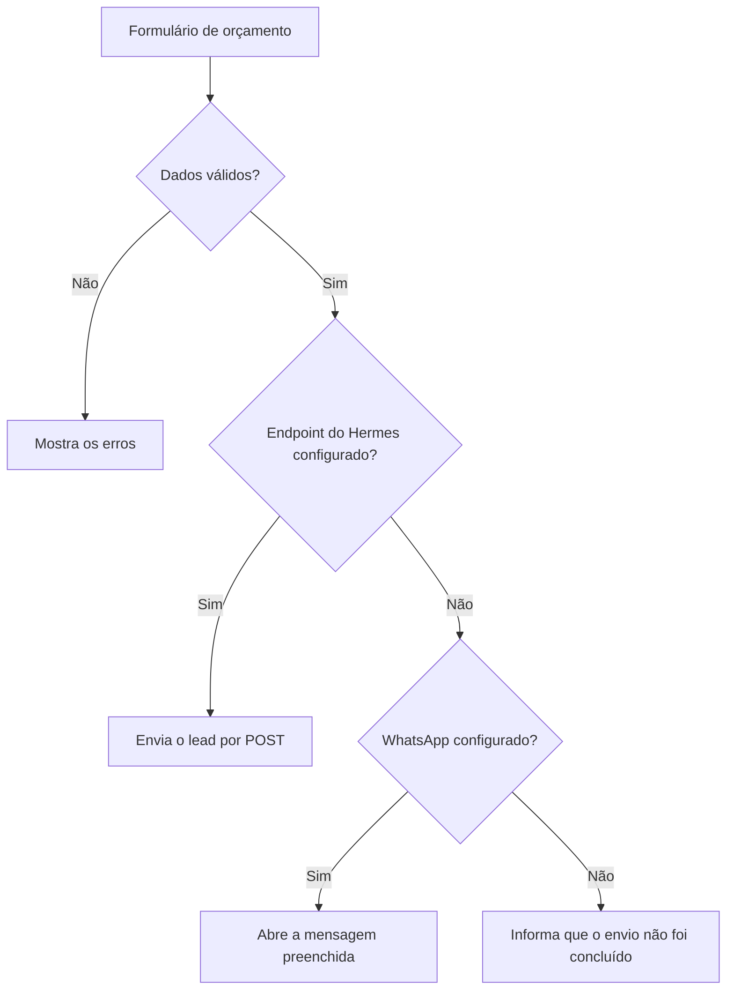
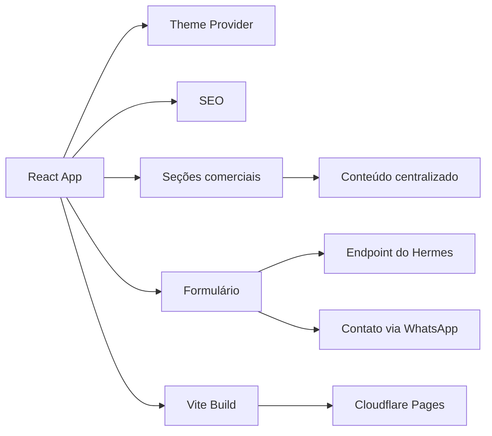

# Barthy Web Studio V1

A primeira versão do site institucional e comercial da **Barthy Web Studio** foi criada para apresentar soluções digitais voltadas a pequenos negócios.

A V1 reúne serviços, sistemas, projetos, processo comercial e canais de contato em uma experiência mais extensa e detalhada. O repositório permanece disponível como registro da evolução técnica e visual da marca.

## Visão rápida

| Item | Descrição |
| --- | --- |
| Tipo | Site institucional e comercial |
| Versão | V1 |
| Aplicação | [barthy-web-studio.pages.dev](https://barthy-web-studio.pages.dev/) |
| Versão atual | [`barthy-web-studio-v2`](https://github.com/g4brielbr4sil/barthy-web-studio-v2) |
| Licença | Proprietária |

## Sobre a Barthy Web Studio

A Barthy Web Studio organiza presença digital, comunicação comercial e soluções técnicas para pequenos negócios. O projeto apresenta possibilidades que podem ser desenvolvidas conforme diagnóstico, necessidade e escopo de cada operação.

Entre as frentes apresentadas estão:

- landing pages e sites institucionais
- portfólios profissionais
- páginas para eventos e campanhas
- formulários e captação de leads
- estrutura comercial digital
- CRM e pipeline
- dashboards e indicadores
- portais e áreas internas
- automações e integrações
- sistemas e plataformas sob medida

## Estrutura da experiência

```text
Header
Hero
O que a Barthy organiza
Soluções
Sistemas e CRM
Produtos e sistemas digitais
Experiência aplicada
Pacotes e preços
Como funciona
Hermes
FAQ
Formulário de orçamento
Footer
```

## Principais funcionalidades

### Presença digital

- landing pages
- portfólios profissionais
- páginas institucionais
- páginas para eventos
- conteúdo organizado
- CTAs e formulários

### Operação comercial

- captação de contatos
- propostas
- mensagens comerciais
- follow-up
- formulários conectados
- encaminhamento de solicitações

### Sistemas e integrações

- CRM e pipeline
- dashboards
- portais e áreas internas
- plataformas com autenticação
- perfis de usuário e permissões
- APIs e conectores
- bots e automações avaliados conforme o contexto

## Captação de leads

O formulário de orçamento coleta informações essenciais para o primeiro diagnóstico:

- nome
- WhatsApp
- e-mail opcional
- empresa
- cidade e UF
- tipo de serviço
- mensagem

O fluxo possui validação dos campos, prevenção de envio duplicado, foco no primeiro erro e estados de carregamento, sucesso e falha.



Quando o endpoint do Hermes responde com sucesso, o lead é registrado pela integração. Sem endpoint, o site utiliza o contato via WhatsApp quando disponível. Falhas são informadas sem exibir uma confirmação de envio incorreta.

## Arquitetura



## Tecnologias

### Interface

- React 18
- TypeScript
- Vite
- Tailwind CSS
- Material UI e Emotion
- Radix UI
- Lucide React

### Interação e visualização

- GSAP
- Motion
- React Hook Form
- React Router
- Recharts
- dnd-kit
- Embla Carousel
- Sonner

### Entrega e qualidade

- pnpm
- Git e GitHub
- GitHub Actions
- TypeScript typecheck
- build automatizado
- auditoria de dependências
- Cloudflare Pages

## Tema e acessibilidade

A interface inclui:

- temas claro e escuro
- aplicação antecipada do tema para reduzir a troca visual no carregamento
- componentes reutilizáveis
- animações progressivas
- suporte a movimento reduzido
- navegação por teclado
- estados de foco
- validação acessível no formulário
- carregamento sob demanda de recursos
- tratamento de falhas

## Estrutura do projeto

```text
src/
  app/
    components/       seções e componentes visuais
    data/             conteúdo e configuração do site
    lib/              tema, Hermes e rastreamento
    types/            contratos TypeScript
  styles/             estilos globais
  main.tsx            inicialização da aplicação
public/                arquivos públicos
```

## Configuração

```env
VITE_HERMES_LEAD_ENDPOINT=
VITE_BARTHY_WHATSAPP_URL=
```

`VITE_HERMES_LEAD_ENDPOINT` define o endpoint de recebimento dos leads.

`VITE_BARTHY_WHATSAPP_URL` define o canal de contato via WhatsApp.

Variáveis com prefixo `VITE_` são públicas no navegador e não devem armazenar credenciais privadas.

## Execução local

### Requisitos

- Node.js conforme `.nvmrc`
- pnpm conforme `packageManager` do `package.json`

```bash
pnpm install
pnpm dev
```

## Validação

```bash
pnpm typecheck
pnpm build
pnpm preview
pnpm audit --prod
```

## V1 e V2

| V1 | V2 |
| --- | --- |
| apresentação comercial extensa | narrativa editorial mais direta |
| catálogo amplo de soluções | foco em projetos, processo e posicionamento |
| Material UI, Radix, GSAP e Motion | Anime.js, CSS e recurso visual com shader |
| integração com Hermes ou WhatsApp | endpoint de contato e fallback por e-mail |
| mais blocos e componentes | experiência mais enxuta |

A V1 representa a primeira estrutura comercial da Barthy. A V2 aprofunda o posicionamento de portfólio e a apresentação dos projetos desenvolvidos.

## Padrão de contribuição

A documentação, os commits e as Pull Requests deste repositório usam português do Brasil, com linguagem técnica, clara e direta. Os commits seguem Conventional Commits com o prefixo técnico em inglês e a descrição em português, como `fix: corrigir validação do formulário`.

O padrão completo está disponível em [`CONTRIBUTING.md`](CONTRIBUTING.md).

## Autor e contato

**Gabriel Brasil Barthy Elias**  
**Barthy Web Studio**

- GitHub: [@g4brielbr4sil](https://github.com/g4brielbr4sil)
- E-mail: [contato.barthywebstudio@gmail.com](mailto:contato.barthywebstudio@gmail.com)

Código, marca, identidade e conteúdo protegidos pela licença disponível em [`LICENSE`](LICENSE).
