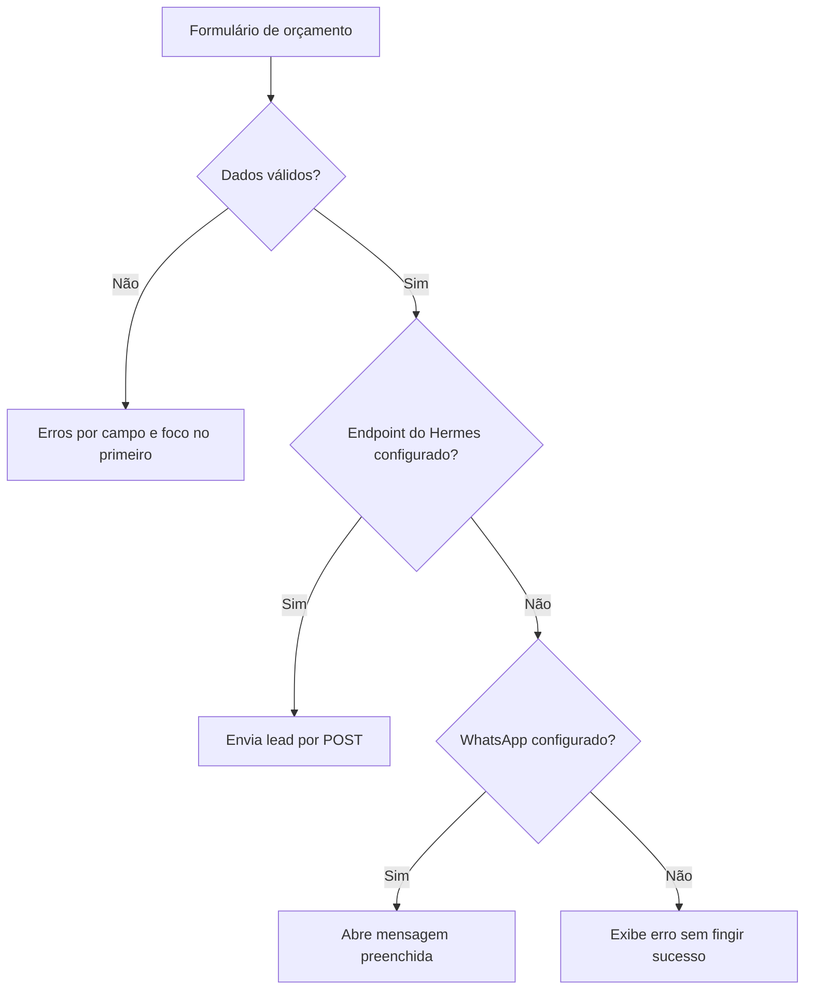
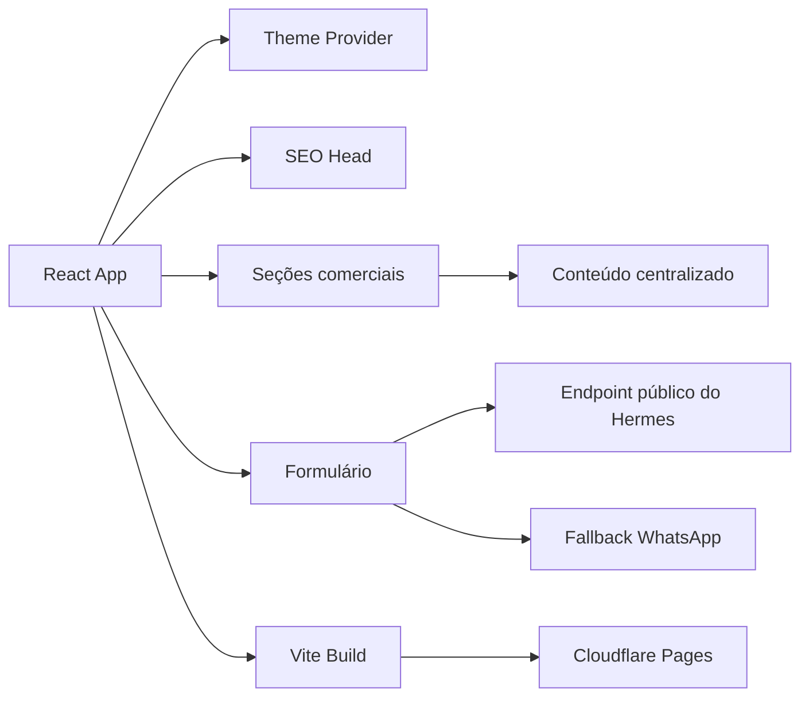

# Barthy Web Studio V1

Primeira versão do site institucional da Barthy Web Studio, operação autoral de soluções digitais para pequenos negócios.

Este repositório não representa toda a operação da Barthy. Ele registra a primeira experiência web criada para apresentar serviços, sistemas, projetos, processo comercial e canais de captação.

## Visão geral

| Item | Situação |
| --- | --- |
| Tipo | Site institucional e comercial |
| Versão | V1 |
| Papel atual | Versão anterior mantida como histórico técnico |
| Direção seguinte | [`barthy-web-studio-v2`](https://github.com/g4brielbr4sil/barthy-web-studio-v2) |
| URL configurada | [barthy-web-studio.pages.dev](https://barthy-web-studio.pages.dev/) |
| Repositório | Público |
| Licença | Proprietária |

A V1 não deve ser apagada, arquivada ou retirada da vitrine antes da publicação e validação da V2. Ela documenta decisões de produto, design, captação e integração que continuam relevantes para o portfólio.

## Objetivo do projeto

A V1 foi criada para mostrar que a Barthy pode atuar em mais de uma camada da presença digital de um negócio:

- apresentação institucional
- landing pages e portfólios
- formulários e captação de leads
- estrutura comercial digital
- CRM e pipeline
- dashboards e indicadores
- portais e áreas internas
- automações e integrações
- sistemas e plataformas sob medida

O site também apresenta experiências aplicadas, pacotes, processo de trabalho, perguntas frequentes e um formulário de orçamento conectado ao Hermes ou ao WhatsApp.

## Estrutura da página

A aplicação é composta pelas seguintes seções:

```text
Header
Hero
O que a Barthy organiza
Soluções
Sistemas e CRM
Produtos e sistemas digitais
Experiência aplicada
Pacotes e preços
Como funciona
Hermes
FAQ
Formulário de orçamento
Footer
```

Essa composição faz da V1 uma apresentação comercial mais extensa e técnica do que a V2.

## Soluções apresentadas no código

### Presença digital

- landing pages
- portfólios profissionais
- páginas institucionais
- páginas de eventos
- conteúdo organizado
- CTAs e formulários

### Operação comercial

- captação de contatos
- propostas
- mensagens comerciais
- follow-up
- formulários conectados
- encaminhamento de solicitações

### Sistemas e integrações

- CRM e pipeline
- dashboards
- portais e áreas internas
- SaaS e plataformas com login
- perfis de usuário
- autenticação e permissões
- APIs e conectores compatíveis
- bots e automações após avaliação técnica

As soluções são apresentadas como possibilidades sujeitas a diagnóstico e escopo. O site não afirma que todo item do catálogo já existe como produto pronto.

## Captação de leads

O formulário de orçamento coleta:

- nome
- WhatsApp
- e-mail opcional
- empresa
- cidade e UF
- tipo de serviço
- mensagem

Validações implementadas:

- campos obrigatórios
- nome com tamanho mínimo
- validação de telefone com DDD
- verificação de e-mail
- limite de tamanho da mensagem
- foco no primeiro campo inválido
- mensagens de erro associadas
- prevenção de envio duplicado
- estados de carregamento, sucesso e erro

### Fluxo de envio



O código só informa envio pelo Hermes quando o endpoint responde com sucesso. Quando o endpoint não está configurado, o sistema tenta abrir o WhatsApp com os dados preenchidos. Se nenhum canal existir, apresenta erro claro.

## Arquitetura da aplicação



## Stack técnica

### Interface

- React 18
- TypeScript
- Vite
- Tailwind CSS
- Material UI e Emotion
- Radix UI
- Lucide React

### Interação e visualização

- GSAP
- Motion
- React Hook Form
- React Router
- Recharts
- dnd-kit
- Embla Carousel
- Sonner

### Entrega e qualidade

- pnpm
- Git e GitHub
- GitHub Actions
- TypeScript typecheck
- build automatizado
- auditoria de dependências
- Cloudflare Pages

A branch de revisão atualiza o React Router da versão 7.13.0 para 7.18.1 e regenera o lockfile para aplicar correções disponíveis na mesma versão principal.

## Tema, movimento e acessibilidade

O código inclui:

- temas claro e escuro
- aplicação do tema antes do primeiro paint para reduzir flash visual
- componentes reutilizáveis
- animações progressivas
- respeito a movimento reduzido
- navegação por teclado
- estados de foco
- validação acessível no formulário
- carregamento sob demanda de recursos técnicos
- tratamento de falhas sem mensagens enganosas

## Estrutura do repositório

```text
src/
  app/
    components/       seções, formulários e componentes visuais
    data/             conteúdo, catálogo e configuração do site
    lib/              tema, integração com Hermes e rastreamento
    types/            contratos TypeScript
  styles/             estilos globais
  main.tsx             inicialização da aplicação
public/                arquivos públicos
```

## Configuração

Os canais reais são fornecidos por variáveis de ambiente.

```env
VITE_HERMES_LEAD_ENDPOINT=
VITE_BARTHY_WHATSAPP_URL=
```

O endpoint do Hermes precisa aceitar requisições públicas apenas das origens autorizadas. Variáveis `VITE_` são públicas no navegador e nunca devem armazenar tokens ou segredos.

## Desenvolvimento local

### Requisitos

- Node.js conforme `.nvmrc`
- pnpm conforme `packageManager` do `package.json`

```bash
pnpm install
pnpm dev
```

## Validação

```bash
pnpm typecheck
pnpm build
pnpm preview
pnpm audit --prod
```

Checklist funcional:

1. temas claro e escuro
2. navegação e CTAs
3. conteúdo em desktop e celular
4. formulário com dados inválidos
5. envio para endpoint de teste
6. fallback para WhatsApp
7. ausência de falso sucesso
8. movimento reduzido
9. foco e navegação por teclado

## Diferenças entre V1 e V2

| V1 | V2 |
| --- | --- |
| dark-first | light-first |
| apresentação comercial extensa | narrativa editorial mais direta |
| catálogo amplo de soluções | foco em projetos, processo e posicionamento |
| Material UI, Radix, GSAP e Motion | stack visual reduzida com Anime.js e shader |
| integração direta com Hermes ou WhatsApp | endpoint genérico e fallback por e-mail |
| maior quantidade de componentes | experiência mais enxuta |

A V1 permanece relevante como prova de evolução de produto e de decisões técnicas. A V2 deve assumir a posição principal somente após estabilização e publicação.

## Limitações e próximos passos

- confirmar a disponibilidade da URL configurada
- produzir screenshots desktop e mobile
- revisar contatos e variáveis de produção
- manter a atualização de dependências validada pelo CI
- documentar a V1 como versão anterior depois da publicação da V2
- não arquivar o repositório antes da decisão final

## Segurança e privacidade

- nenhum segredo deve usar prefixo `VITE_`
- dados reais de leads não devem aparecer no repositório
- screenshots devem utilizar informações fictícias
- endpoint público precisa limitar origens e validar os dados recebidos
- relatórios e eventos de diagnóstico não devem conter informações pessoais
- nenhuma integração externa deve ser ativada sem configuração e validação

## Autoria e licença

Projeto desenvolvido por Gabriel Brasil para a Barthy Web Studio.

Código, marca, identidade, conteúdo e documentação são proprietários. Consulte [`LICENSE`](LICENSE).